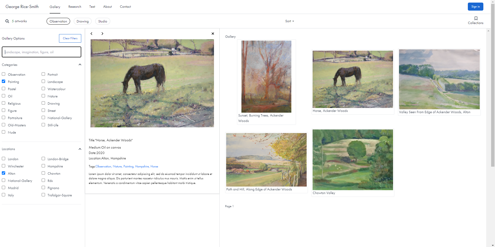

<h1 align="center">Artist's Portfolio and CMS</h1>

<div align="center">
  :man_artist:
</div>
<div align="center">
  <strong>Inspired by the intersection between Art and Programming</strong>
</div>

<br />

<div align="center">
  <!-- Stability -->
  <a href="https://nodejs.org/api/documentation.html#documentation_stability_index">
    
  </a>
  <!-- NPM version -->
  <a href="https://npmjs.org/package/choo">
    
  </a>
  <!-- Build Status -->
  <a href="https://travis-ci.org/choojs/choo">
    
  </a>
  <!-- Test Coverage -->
  <a href="https://codecov.io/github/choojs/choo">
    
  </a>
  <!-- Standard -->
  <a href="https://standardjs.com">
    
  </a>
</div>

<div align="center">
  <h3>
    <a href="https://grs-art-portfolio-cms.netlify.app/">
      Website
    </a>
    <span> | </span>
    <a href="https://github.com/grs-se/art-portfolio-cms--api-server">
      REST API
    </a>
  </h3>
</div>

<div align="center">
  <sub>Built for artists, with ❤︎ by
  <a href="https://twitter.com/">GRS</a>
</div>

## Table of Contents

- [Features](#features)
- [Example](#example)
- [Philosophy](#philosophy)
- [Events](#events)
- [State](#state)
- [Routing](#routing)
- [Server Rendering](#server-rendering)
- [Components](#components)
- [Optimizations](#optimizations)
- [FAQ](#faq)
- [API](#api)
- [Installation](#installation)
- [See Also](#see-also)
- [Support](#support)

## Features

- **isomorphic:** renders seamlessly in both Node and browsers
- **cloud asset storage:**

<div align="center">
    
</div>
<br/>

## Technologies

<p align="center">

<!-- <a href="https://github.com/vuejs/vue">
    
  </a> -->
  <!-- <a href="https://github.com/lin-xin/vue-manage-system/blob/master/LICENSE">
    
  </a> -->
  <a href="https://github.com/vuejs/vue">
    
  </a>
   <a href="https://github.com/nuxt">
    
  </a>
  <!-- <a href="https://github.com/vuejs/pinia">
   
  </a> -->
   <a href="https://github.com/tailwindcss">
    
   </a>
</p>

## Live Demo Site

https://grs-art-portfolio-cms.netlify.app/

## Project Overview

I am a self-taught entry level software developer with a range of transferable skills. I began learning to code just before “lockdown”, whilst working full-time in Landscape Construction. My motivation was to build an art portfolio website linked to a database that a user could interact with in many ways: sorting, filtering, different viewing modes, commenting, bookmarking, etc. However, I quickly became fascinated with programming and this project became more ambitious, a training ground to learn more advanced programming concepts: state-management, universal and client-side rendering, cloud asset management, authentication and authorization, etc. These days I program more than making art!

This project is currently in a simple form as a public display portfolio, but I am in the process of implementing additional functionality to upgrade the project to include the following functionality:

- CMS, to enable artist's to manage and archive all of their artworks
- An artist's educational e-resource book - to compile inspiration resources;
- A review and critiquing platform for mentors and fellow artist's to interact with each other and the artworks, and provide feedback.

A 'Universal' rendered application built with Vue.js(3), Nuxt(3), Pinia. Source code for the accompaying backend project - a custom REST API server - can be found at: https://github.com/grs-se/art-portfolio-cms--api-server

Please note: this project is still in development, contains faults and unfinished implementation, and is not ready for production use.

### Project Screenshots

|                                                         |                                                                     |
| ------------------------------------------------------- | ------------------------------------------------------------------- |
| .png>)            | .png>) |
| .png>) | .png>)         |

## Features

- [ ] = Partially Implemented Funtionality
<hr/>

- [ ] Post Creation
- [ ] Post Editing
- [ ] Post Deletion
- [ ] Post Liking
- [ ] Post Commenting
- [ ] Post Tagging
- [x] Post Searching
- [x] Post Filtering
- [ ] Post Bookmarking

### UI Features

- [ ] Mobile Responsive
- [ ] Dark Mode
- [x] Gallery Modes
  - [x] Grid
  - [x] Masonry
  - [x] Lightbox
  - [x] Carousel
  - [x] Spotlights
  - [x] Modal
  - [x] Aside

## Production

Build the application for production using netlify-cli:

```bash
netlify build && netlify deploy --prod
```

## Further Project Goals

- User and Admin Accounts

## Contact me

<div align="center">
<a href="https://github.com/grs-e" target="_blank">

</a>
<a href = "mailto:georgericesmith@gmail.com?subject = Feedback&body = Message">

</a>
</div>
